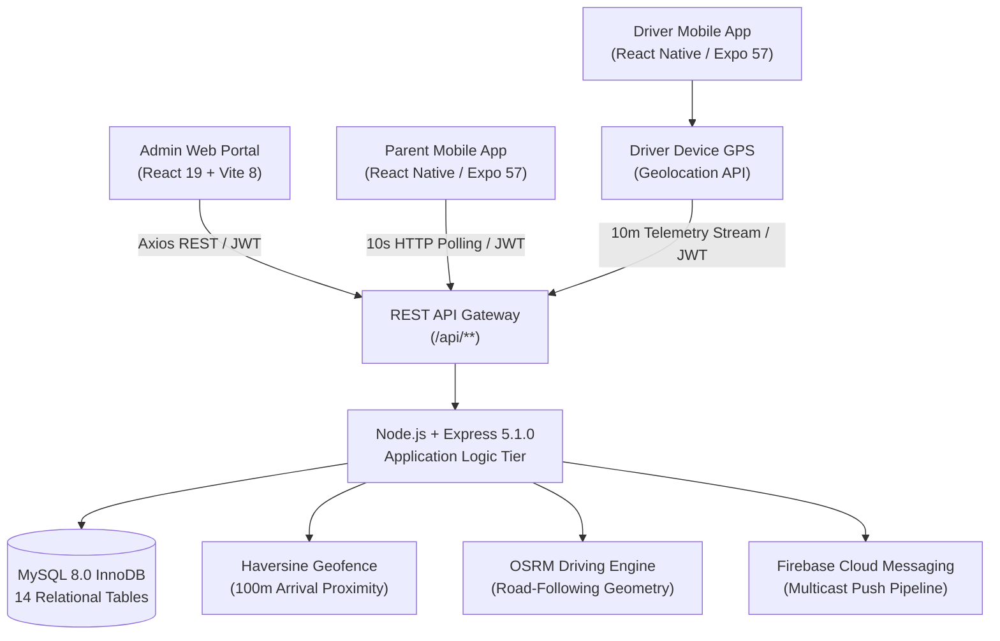

# School Bus Tracking & Student Safety Portal

[](https://nodejs.org/)
[](https://expressjs.com/)
[](https://react.dev/)
[](https://vite.dev/)
[](https://reactnative.dev/)
[](https://expo.dev/)
[](https://www.mysql.com/)
[](LICENSE)

A production-grade, multi-tenant school transit coordination and student safety platform. Engineered to eliminate operational blindspots in institutional pupil transportation through driver-device GPS telemetry streaming, OSRM road-following geometry, mathematical Haversine geofence proximity detection, database-enforced seating collision invariants, and role-based mobile applications for drivers and guardians.

---

## Architecture Diagram



---

## Table of Contents

- [System Overview](#system-overview)
- [The Problem Statement](#the-problem-statement)
- [The Architectural Solution](#the-architectural-solution)
- [Key Features](#key-features)
  - [1. Web Administration Portal](#1-web-administration-portal)
  - [2. Driver Mobile Application](#2-driver-mobile-application)
  - [3. Parent Mobile Application](#3-parent-mobile-application)
  - [4. Backend Telematics & Spatial Engine](#4-backend-telematics--spatial-engine)
- [Verified Technology Stack](#verified-technology-stack)
- [Repository Structure](#repository-structure)
- [Step-by-Step Installation & Setup](#step-by-step-installation--setup)
  - [Prerequisites](#prerequisites)
  - [1. Database Configuration](#1-database-configuration)
  - [2. Backend Setup](#2-backend-setup)
  - [3. Web Administration Frontend Setup](#3-web-administration-frontend-setup)
  - [4. Driver Mobile Application Setup](#4-driver-mobile-application-setup)
  - [5. Parent Mobile Application Setup](#5-parent-mobile-application-setup)
- [Testing & Verification Suites](#testing--verification-suites)
- [Current Implementation vs. Future Roadmap](#current-implementation-vs-future-roadmap)
- [Formal Project Documentation](#formal-project-documentation)
- [Authors & Academic Guidance](#authors--academic-guidance)
- [License](#license)

---

## System Overview

The **School Bus Tracking & Student Safety Portal** provides an end-to-end digital nervous system for educational transportation. Replacing archaic paper manifests and high-latency telephone chains, the platform connects institutional dispatch coordinators, commercial bus drivers, and pupil guardians in real time.

Built on a decoupled three-tier architecture, the platform pairs an **Express 5.x / Node.js** backend with **MySQL 8.0 (InnoDB)**, serving an administrative Single Page Application (**React 19 / Vite 8**) and twin cross-platform mobile applications (**React Native 0.86 / Expo SDK 57**).

---

## The Problem Statement

School transportation systems in urban and semi-urban settings face acute logistical vulnerabilities:
1. **Curbside Uncertainty**: Parents endure extended waits at isolated stops without visibility into vehicle delays or route progress.
2. **Driver Distraction**: Drivers receive distracting telephone inquiries while navigating dense morning traffic.
3. **Seating Over-Allocation**: Ad-hoc passenger seating manifests lead to duplicate seat allocations and capacity disputes.
4. **Custodial Blindspots**: Unrecorded boarding transitions leave schools vulnerable to legal liability during student handoffs.
5. **Capital Cost Prohibitions**: Commercial vehicle tracking systems require costly proprietary on-board diagnostics (OBD-II) units ($300–$800/bus) and recurring subscriptions.

---

## The Architectural Solution

The platform resolves these challenges through software-driven commoditization:
- **Zero Dedicated Hardware**: Uses commercial drivers' smartphones for GPS telematics rather than proprietary black-box hardware.
- **Relational Invariant Enforcement**: Eliminates double-booking via MySQL composite unique constraints directly in B+ Tree storage.
- **Street-Level Cartography**: Employs OpenStreetMap (OSM) via Leaflet.js with OSRM (Open Source Routing Machine) road-snapping rather than straight-line approximations.
- **Resilient Offline Buffering**: Driver telemetry incorporates a client-side FIFO buffer (`telemetryQueue.js`) ensuring zero coordinate loss during cellular network dropouts.
- **Granular Role-Based Security**: Strict JWT and row-level access policies guarantee complete tenant isolation between parents and drivers.

---

## Key Features

### 1. Web Administration Portal
- **Fleet Asset Governance**: Full lifecycle management of buses, license plates, seating capacities, and road-readiness states.
- **Driver Personnel Registry**: Licensing verification, employee codes, and assigned vehicle bindings.
- **Route & Stop Waypoint Studio**: Interactive route builder with geocoded stops, stop order sequence, and 100m arrival radii.
- **Interactive Seat Assignment Matrix**: Visual bus layout modal with real-time seat allocation, capacity counters, and database-enforced double-booking prevention.
- **Trip Dispatcher**: Conflict-free scheduling linking vehicle, driver, route, and shift.

### 2. Driver Mobile Application
- **Distraction-Free Cockpit**: High-contrast, single-touch trip activation designed for cabin safety.
- **Background-Resilient Telemetry**: GPS polling using `distanceFilter: 10m` to capture location, speed, and heading without battery drain.
- **Offline Telemetry Queue**: Buffers coordinates in local secure storage during cellular blackouts; flushes sequentially upon reconnection.
- **Digital Student Attendance Roster**: One-tap passenger custody recording (`WAITING` → `BOARDED` → `DROPPED_OFF` / `ABSENT`) with server timestamps.

### 3. Parent Mobile Application
- **Multi-Child Dashboard**: Dynamic switcher enabling guardians to monitor multiple enrolled siblings across different buses.
- **Live Interactive Journey Map**: WebView map rendering live bus position, road geometry, scheduled stops, and child's designated dropoff point.
- **Stop Progression Timeline**: Step-by-step waypoint completion indicator displaying reached stops and estimated arrival times.
- **Proximity Alerts**: Automated curbside alerts when the vehicle enters the 100m stop geofence radius.
- **In-App Notification Feed**: Persistent event log detailing trip activation, passenger boarding, and route completion.

### 4. Backend Telematics & Spatial Engine
- **Mathematical Geodesic Evaluation**: Spherical Haversine formula calculation executed on incoming GPS coordinates to detect stop arrivals within 100m.
- **OSRM Road Network Snapping**: Decodes and caches Polyline5/Polyline6 road geometries with a 24-hour in-memory cache.
- **FCM Push Notification Pipeline**: Automated multicast formatting via `firebase-admin` SDK targeting registered parent device tokens.

---

## Verified Technology Stack

| Layer / Subsystem | Technology | Verified Version | Core Responsibility |
| :--- | :--- | :---: | :--- |
| **Backend Runtime** | Node.js | `v20.x` / `v24.x` LTS | Asynchronous event-driven execution environment |
| **Application Framework** | Express.js | `^5.1.0` (Express 5.x) | REST API routing, controllers, and middleware pipeline |
| **Relational Database** | MySQL Community Server | `8.0.x` (InnoDB) | ACID persistence, referential foreign keys, 14 tables |
| **Database Driver** | `mysql2` | `^3.14.4` | High-performance binary connection pooling |
| **Password Hashing** | `bcryptjs` | `^3.0.3` | One-way cryptographic salting and password verification |
| **Token Authentication** | `jsonwebtoken` | `^9.0.2` | Stateless Bearer token issuance and signature verification |
| **HTTP Security** | `helmet` / `cors` | `^8.1.0` / `^2.8.5` | Content Security Policy, XSS protection, CORS whitelisting |
| **Push Notification SDK**| `firebase-admin` | `^14.5.0` | Server-side FCM device token multicast dispatch |
| **Web Frontend** | React.js | `^19.2.8` (React 19) | Declarative component UI and state reconciliation |
| **Build Bundler** | Vite | `^8.3.0` (Vite 8) | Instant Hot Module Replacement (HMR) and optimized Rollup builds |
| **Web Styling** | Tailwind CSS | Utility-First | Responsive design with accessible color contrasts |
| **Mobile Runtime** | React Native | `0.86.3` | Native cross-platform mobile views compiled for iOS & Android |
| **Mobile Framework** | Expo SDK | `57.0.0` | Mobile native bridges, permissions, and toolchains |
| **Mobile UI Library** | React (Mobile) | `19.2.3` | Mobile view lifecycle and hook state management |
| **Map Rendering** | Leaflet.js | `1.9.4` | Open-source mobile/desktop interactive tile cartography |
| **Map Tile Provider** | OpenStreetMap (OSM) | Standard Carto | Free, community-driven global street tiles |
| **Road Routing Engine** | OSRM v1 API | Driving Profile | Real road network routing and waypoint sequencing |

---

## Repository Structure

```text
School-Bus-Tracking-Student-Safety-Portal/
├── README.md                               # Project overview, architecture, and documentation
├── LICENSE                                 # MIT Open Source License
├── .gitignore                              # Comprehensive exclusions (node_modules, .env, dist)
├── StudentBusPortal.mwb                    # MySQL Workbench Relational Data Model
│
├── frontend/                               # Web Administration Single Page Application
│   ├── src/                                # React 19 pages, components, context, and styles
│   ├── public/                             # Static assets, SVG icons, and favicons
│   ├── package.json                        # React 19.2.8, Vite 8.3.0, Tailwind CSS
│   └── vite.config.js                      # Vite production build pipeline
│
├── backend/                                # Node.js / Express 5.1.0 REST API Application
│   ├── src/
│   │   ├── config/                         # Database connection pool and environment loading
│   │   ├── controllers/                    # Business logic (auth, bus, driver, seat, tracking, trip)
│   │   ├── middleware/                     # JWT authentication, RBAC authorization, error handlers
│   │   ├── routes/                         # Modular Express router endpoints
│   │   ├── services/                       # Geocoding, OSRM routing, FCM notification, stop detection
│   │   ├── utils/                          # ApiError, asyncHandler, token generators
│   │   └── server.js                       # Express HTTP bootstrap listener
│   ├── database/                           # Internal database schema file (schema.sql)
│   ├── scripts/                            # Internal migration scripts (migrate.js, seed-admin.js)
│   ├── .env.example                        # Safe environment variable template
│   └── package.json                        # Express 5.1.0, mysql2, bcryptjs, helmet
│
├── mobile-driver-app/                      # Driver Mobile Application
│   ├── src/
│   │   ├── api/                            # Client-side Axios HTTP API bindings
│   │   ├── components/                     # Reusable mobile UI components
│   │   ├── context/                        # AuthContext, TrackingContext
│   │   ├── screens/                        # ActiveCockpit, TripsList, StudentRoster, Diagnostics
│   │   └── services/                       # telemetryQueue.js (FIFO offline GPS buffer)
│   ├── App.js                              # Main driver application entry point
│   ├── app.json                            # Expo SDK 57 configuration
│   └── package.json                        # React Native 0.86.3, Expo 57.0.0
│
├── mobile-parent-app/                      # Parent Mobile Application
│   ├── src/
│   │   ├── api/                            # Parent API and live tracking endpoints
│   │   ├── components/                     # LiveTrackingMapView, StopTimeline, ChildSwitcher
│   │   ├── context/                        # ParentDashboardContext, AuthContext
│   │   ├── screens/                        # HomeScreen, LiveTrackingScreen, NotificationsScreen
│   │   └── services/                       # notificationService.js
│   ├── App.js                              # Main parent application entry point
│   ├── app.json                            # Expo SDK 57 configuration
│   └── package.json                        # React Native 0.86.3, Expo 57.0.0
│
├── database/                               # Canonical Database Assets & Documentation
│   ├── schema.sql                          # Complete 14-table DDL schema with seating constraints
│   ├── seed.sql                            # Initial demonstration accounts, routes, and buses
│   └── README.md                           # Database entity data dictionary and relational design
│
├── docs/                                   # Formal Project Documentation & Multimedia
│   ├── report/                             # 123-Page Formal Academic Project Reports
│   │   ├── School_Bus_Tracking_Student_Safety_Portal.pdf
│   │   ├── School_Bus_Tracking_Student_Safety_Portal.docx
│   │   └── README.md
│   ├── diagrams/                           # Architectural, Database, DFD, and Sequence Visuals
│   │   ├── architecture/                   # System tier diagram
│   │   ├── database/                       # Complete 14-table ER Diagram
│   │   ├── dfd/                            # Multi-level Data Flow Diagrams
│   │   ├── use-case/                       # Actor use case diagrams
│   │   ├── sequence/                       # Auth, GPS, Routing, FCM, and Seat assignment flows
│   │   └── README.md
│   └── screenshots/                        # High-Resolution UI Exhibits
│       ├── admin/                          # Web Admin desktop and mobile views
│       ├── driver/                         # Driver cockpit and roster exhibits
│       ├── parent/                         # Parent tracking map and notifications
│       └── README.md
│
└── scripts/                                # Project-Level Verification & Integration Suites
    ├── test-seat-and-location.mjs          # Seat assignment collision and geocoding test
    ├── test-parent-seat-integration.mjs    # Parent child linkage and seat display test
    ├── test-fcm-backend.mjs                # 13-test FCM token registration & isolation suite
    ├── test-live-map-pipeline.mjs          # GPS telemetry ingestion & OSRM road geometry test
    ├── test-driver-endpoints.mjs           # Driver authentication and shift management
    ├── test-parent.mjs                     # Parent dashboard and student queries
    ├── test-tracking.mjs                   # Spatial proximity and geofencing validation
    ├── verify-e2e-scenario.mjs             # Full end-to-end student commute lifecycle
    ├── check-db-state.mjs                  # Active shift and driver database diagnostics
    ├── reset-demo.mjs                      # Test data state reset script
    └── README.md                           # Testing execution guide
```

---

## Step-by-Step Installation & Setup

### Prerequisites
- **Node.js**: `v20.x` or `v24.x` LTS installed.
- **MySQL Server**: `MySQL 8.0` installed and running on port `3306`.
- **Package Manager**: `npm` (v10+).
- **Mobile Emulation**: Expo Go app on iOS/Android or native mobile simulator.

---

### 1. Database Configuration
Create the database and apply the schema:
```bash
# Option A: Using MySQL Command Line Client
mysql -u root -p < database/schema.sql
mysql -u root -p < database/seed.sql

# Option B: Using Backend NPM Migration Pipeline
cd backend
npm install
npm run db:migrate
npm run db:seed
```

---

### 2. Backend Setup
```bash
cd backend

# Install dependencies
npm install

# Configure environment variables
cp .env.example .env
# Edit .env with your local MySQL credentials:
# DB_HOST=localhost
# DB_PORT=3306
# DB_USER=root
# DB_PASSWORD=your_mysql_password
# JWT_SECRET=your_jwt_secret_key

# Start the REST API application server (Default port: 5000)
npm start
```
Verify server health at: `http://localhost:5000/api/health`  
Expected response:
```json
{
  "status": "ok",
  "service": "school-bus-portal-api"
}
```

---

### 3. Web Administration Frontend Setup
```bash
cd frontend

# Install dependencies
npm install

# Configure environment variables
cp .env.example .env
# Ensure VITE_API_BASE_URL=http://localhost:5000/api

# Run local development server
npm run dev

# Or compile production optimized build
npm run build
```
Access the administrative portal at: `http://localhost:5173`

---

### 4. Driver Mobile Application Setup
```bash
cd mobile-driver-app

# Install dependencies
npm install

# Verify Expo configuration
npx expo config

# Launch Metro bundler
npx expo start
```
Scan the QR code using the **Expo Go** application on your physical mobile device or press `a` for Android Emulator / `i` for iOS Simulator.

---

### 5. Parent Mobile Application Setup
```bash
cd mobile-parent-app

# Install dependencies
npm install

# Verify Expo configuration
npx expo config

# Launch Metro bundler
npx expo start
```
Scan the QR code using the **Expo Go** application on your physical mobile device or launch your preferred mobile emulator.

---

## Testing & Verification Suites

The repository contains automated verification suites ensuring complete operational stability:

```bash
# Ensure backend server is running on port 5000, then from repository root:

# 1. Seat Matrix Allocation & Concurrency Collision Test:
node scripts/test-seat-and-location.mjs

# 2. Parent-Child Relationship & Seat Integration Test:
node scripts/test-parent-seat-integration.mjs

# 3. Backend FCM Multicast & Token Isolation Suite (13/13 passing):
node scripts/test-fcm-backend.mjs

# 4. Live Driver GPS Telemetry & OSRM Road Geometry Pipeline:
node scripts/test-live-map-pipeline.mjs

# 5. Full End-to-End Commute Scenario:
node scripts/verify-e2e-scenario.mjs
```

---

## Current Implementation vs. Future Roadmap

In the interest of rigorous engineering integrity, the platform maintains clear boundaries between **verified, working functionality** and **future architectural roadmap blueprints**:

| Dimension | Implemented & Verified in Codebase | Future Architectural Roadmap (Documented) |
| :--- | :--- | :--- |
| **GPS Telematics Source** | Authenticated commercial driver smartphone GPS hardware via mobile Geolocation API. | Proprietary on-vehicle OBD-II CAN-bus telematics black-box hardware units. |
| **Parent Live Tracking** | Near-real-time foreground HTTP polling on a 10-second cadence. | Full-duplex persistent bi-directional WebSockets / Server-Sent Events (SSE). |
| **Map & Road Geometry** | Leaflet.js with OpenStreetMap (OSM) tiles; OSRM driving engine road snapping. | Google Maps paid tracking APIs (Google Maps is NOT used for active bus tracking). |
| **Push Notifications** | Backend FCM registration, storage, and multicast dispatch pipeline (13/13 tests passing). | Native physical lock-screen push alerts (requires Apple APNs / Google Play Services hardware provisioning). |
| **Emergency Protocols** | Visual active cockpit status transitions and digital attendance discrepancy flagging. | Dedicated physical SOS hardware panic buttons and emergency siren broadcast endpoints. |
| **Student Attendance** | One-touch mobile attendance roster with custodial state timestamps (`WAITING` → `BOARDED`). | Physical RFID / NFC smart card turnstiles mounted at bus entrance doors. |
| **Deployment Model** | Local local-area-network (LAN) multi-device staging setup. | Production Cloud Infrastructure on AWS (EC2 Auto Scaling, RDS MySQL Multi-AZ, CloudFront CDN). |
| **Route Optimization** | OSRM road geometry generation with 24-hour in-memory cache. | AI dynamic machine-learning traffic rerouting models. |

---

## Formal Project Documentation

The repository includes the complete **123-page academic engineering documentation**, formatted to KL University undergraduate engineering standards:

- **PDF Version**: [`docs/report/School_Bus_Tracking_Student_Safety_Portal.pdf`](docs/report/School_Bus_Tracking_Student_Safety_Portal.pdf)
- **DOCX Version**: [`docs/report/School_Bus_Tracking_Student_Safety_Portal.docx`](docs/report/School_Bus_Tracking_Student_Safety_Portal.docx)
- **Architectural Diagrams**: [`docs/diagrams/`](docs/diagrams/)
- **UI Exhibits**: [`docs/screenshots/`](docs/screenshots/)

---

## Authors & Academic Guidance

### Project Investigators
- **Nelabhotla Yeswanth Kumar** (Regd. No: 2520030183) — *Department of Computer Science & Engineering*
- **Dugganaboyina Mohit Venkat Sai** (Regd. No: 2520030106) — *Department of Computer Science & Information Technology*

### Academic Guide
- **Dr. D. Ramya Krishna** — *Assistant Professor, Department of Computer Science & Engineering*

**Koneru Lakshmaiah Education Foundation (KL University)**  
Bowrampet, Hyderabad, Telangana — 500043, India  
Academic Year: 2026–2027

---

## License

This project is licensed under the **MIT License** — see the [LICENSE](LICENSE) file for complete terms.
